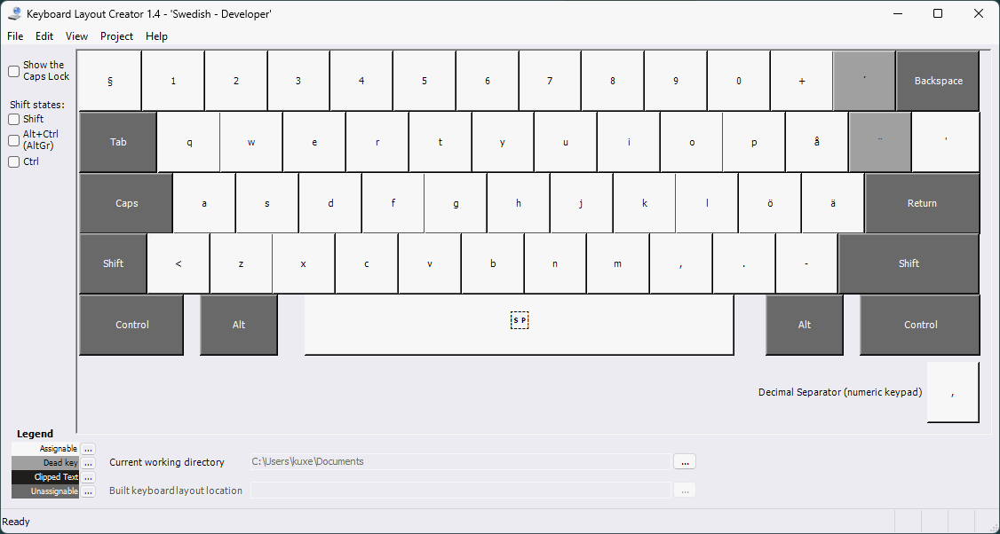
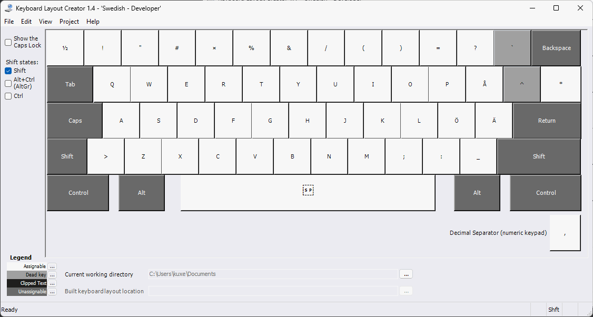
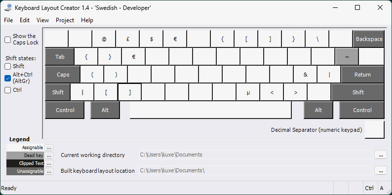

# sv-dev
Swedish (programmer) layout. I created this to mimic behavior of my previous *GK64*, now replaced by *8BitDo Retro Mechanical Keyboard*. Further, the 8BitDo keyboard lacks the <kbd><|></kbd>-key usually found to the left of <kbd>Z</kbd>-key at Swedish keyboards.

**no modifier**

**shift modifier**

**alt-gr modifier**

## Instructions
Be careful when running `.exe`-files you download on github, or anywhere else. You can recreate `setup.exe` yourself by:
1. Download and install [Microsoft Keyboard Layout Creator (MSKLC) Version 1.4](https://www.microsoft.com/en-us/download/details.aspx?id=102134)
2. Open *Microsoft Keyboard Layout Creator 1.4*
3. *File* -> *Load source file...*
4. Select `sv-dev.klc`
5. *Project* -> *Build DLL and Setup Package*

Or if you feel courageous, trust me and just run the uploaded `setup.exe`.

Happy coding! 👍